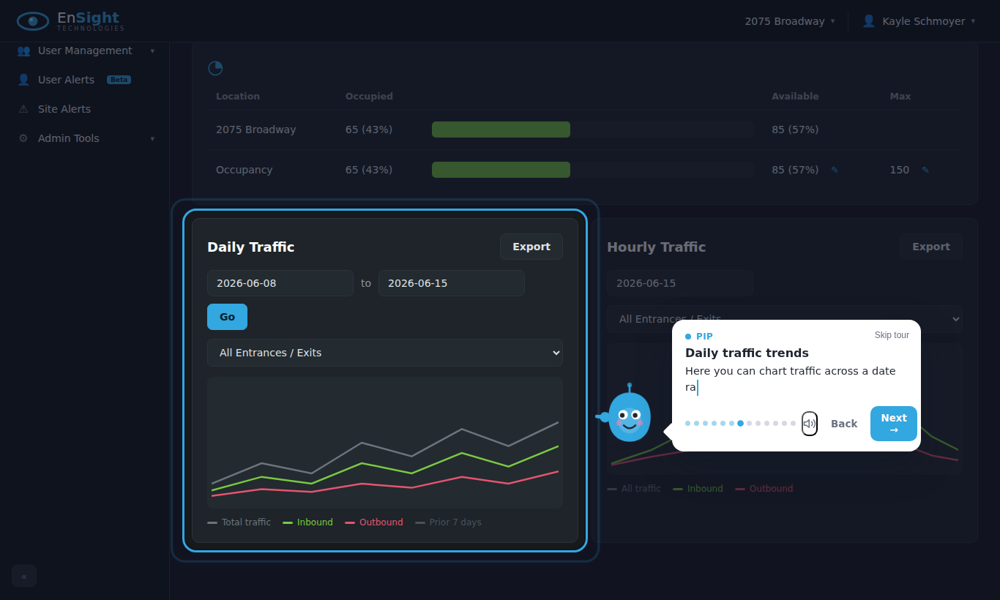

# Walkthrough 🍫

An animated, **character-guided product walkthrough** for any web page — inspired
by the "4D" character tours at places like Hershey's Chocolate World.

A friendly character pops up, introduces itself, and walks the user through your
UI one step at a time: it **switches to the right tab, spotlights the element,
points at it, and explains what it does** in a speech bubble (with optional spoken
narration). Perfect for onboarding, teaching, and product tours.



## ✨ Features

- 🎭 **Animated SVG character** — blinks, bobs, waves on the intro, and rotates
  its arm to point directly at whatever it's describing.
- 🔦 **Spotlight + dim** — focuses the user on one element at a time.
- 💬 **Typed speech bubble** with optional **browser text-to-speech** narration
  (free, built-in — no API keys) and a mute toggle.
- 🗂️ **Tab-aware** — a step can auto-open the tab/section that contains its target.
- ⌨️ **Keyboard control** — `→`/`Enter` next, `←` back, `Esc` to skip.
- 🔁 **Re-openable** — a floating "Show me around" launcher replays the tour.
- 💾 **Remembers** finished tours via `localStorage` so you only auto-run once.
- 📦 **Framework-agnostic & tiny** — ~6.5 kB gzipped, no dependencies, drops into
  React, Vue, plain HTML, WordPress… anything. Styles inject themselves.

---

## 🚀 Run the demo locally

This repo ships with a full demo — a mock of the **EnSight portal** (a parking
garage occupancy / vehicle-counting admin dashboard) — so you can see the whole
effect immediately.

### 1. Get the code

```bash
# Clone the repository
git clone https://github.com/kayleschmoyer/Walkthrough.git
cd Walkthrough

# (If you're reviewing this feature branch specifically:)
git checkout claude/repo-reset-th6zj7
```

> **Prerequisites:** [Node.js](https://nodejs.org) **18 or newer** (this was built
> on Node 22). Check with `node --version`.

### 2. Install dependencies

```bash
npm install
```

### 3. Start the dev server

```bash
npm run dev
```

You'll see output like:

```
  VITE v5.4.x  ready in 231 ms
  ➜  Local:   http://localhost:5173/
```

### 4. Open it

Open **http://localhost:5173/** in your browser.

The tour **auto-starts** on first visit — Pip pops up and guides you through the
dashboard's sections and buttons. Try these:

- Click **Next / Back** (or use arrow keys) to move through the steps.
- Watch Pip spotlight each area — stat cards, the occupancy table, traffic charts —
  and **auto-expand the sidebar's Signage menu** to show nested navigation.
- Click the **🔊 speaker icon** to toggle spoken narration.
- Click **Skip tour**, then use the floating **"Show me around"** button (bottom-right)
  to replay it any time.

> 💡 The tour only auto-runs once (it's remembered in `localStorage`). To force it
> again, open DevTools console and run `tour.start()`, or clear site data.

### Other commands

| Command              | What it does                                            |
| -------------------- | ------------------------------------------------------- |
| `npm run dev`        | Start the demo with hot reload                          |
| `npm run build`      | Build the demo site to `dist/`                          |
| `npm run preview`    | Serve the production build locally                      |
| `npm run build:lib`  | Build the reusable widget bundle (ES + UMD) to `dist/`  |
| `npm run typecheck`  | Type-check the project                                  |

---

## 🔌 Use it in your own site

The walkthrough engine lives in [`src/walkthrough/`](src/walkthrough/) and has **no
dependencies**. Copy that folder into your project (or build it with
`npm run build:lib` and import the bundle), then:

```ts
import { Walkthrough } from "./walkthrough";

const tour = new Walkthrough({
  characterName: "Pip",
  accentColor: "#6c5ce7",
  speech: true,                 // narrate aloud with the browser voice
  storageKey: "my-app-tour",    // remember when the user has seen it
  steps: [
    {
      title: "Welcome! 👋",
      text: "I'll show you around in 30 seconds.",
      // no `target` → the character speaks "to camera", centered
    },
    {
      target: "#settings-btn",   // CSS selector or an HTMLElement
      title: "Settings",
      text: "Open your settings from here.",
      side: "left",              // optional: auto | left | right | top | bottom
    },
    {
      openTab: '#tab-billing',   // clicked first, so the target becomes visible
      target: "#upgrade-btn",
      title: "Upgrade",
      text: "And this is where you upgrade your plan.",
    },
  ],
  onFinish: () => console.log("done!"),
});

// Auto-run for first-time users, and always offer a replay button:
tour.mountLauncher("Show me around");
if (!tour.completed) tour.start();
```

### Step options

| Field      | Type                                          | Description                                            |
| ---------- | --------------------------------------------- | ------------------------------------------------------ |
| `target`   | `string \| HTMLElement`                       | Element to spotlight & point at. Omit for "to camera". |
| `title`    | `string`                                      | Optional bold heading.                                 |
| `text`     | `string`                                      | What the character says (typed + spoken).              |
| `openTab`  | `string \| HTMLElement`                       | Clicked **before** the step so the target is visible.  |
| `side`     | `"auto" \| "left" \| "right" \| "top" \| "bottom"` | Preferred placement of the character.             |
| `padding`  | `number`                                      | Extra px around the highlighted element.               |
| `onShow`   | `(step, index) => void`                       | Runs when the step becomes active.                     |

### Walkthrough options

`characterName`, `accentColor`, `speech`, `startMuted`, `keyboard`, `storageKey`,
plus callbacks `onFinish`, `onSkip`, `onStep`. See
[`src/walkthrough/types.ts`](src/walkthrough/types.ts) for the full, documented API.

### Controlling the tour

```ts
tour.start();        // begin (true = from the start, false = resume)
tour.next();         // advance
tour.prev();         // go back
tour.goTo(2);        // jump to a step
tour.skip();         // dismiss early
tour.destroy();      // tear down completely
tour.completed;      // boolean — has this user finished it before?
```

---

## 🎨 Customizing the character

The mascot is plain inline SVG in
[`src/walkthrough/character.ts`](src/walkthrough/character.ts) and is driven by CSS
variables, so you can recolor it via `accentColor` or swap the SVG for your own
brand art. The only contract is the `.wt-char-arm` group (the part that rotates to
point) and the `point()` / `rest()` / `wave()` methods.

## 📁 Project structure

```
src/
  walkthrough/        ← the reusable, framework-agnostic widget
    walkthrough.ts    ← the controller (positioning, narration, navigation)
    character.ts      ← the animated SVG mascot
    styles.ts         ← self-injecting scoped CSS
    types.ts          ← public TypeScript API
    index.ts          ← exports
  demo/               ← the EnSight portal mock that showcases it
index.html            ← demo entry
```

## License

MIT
